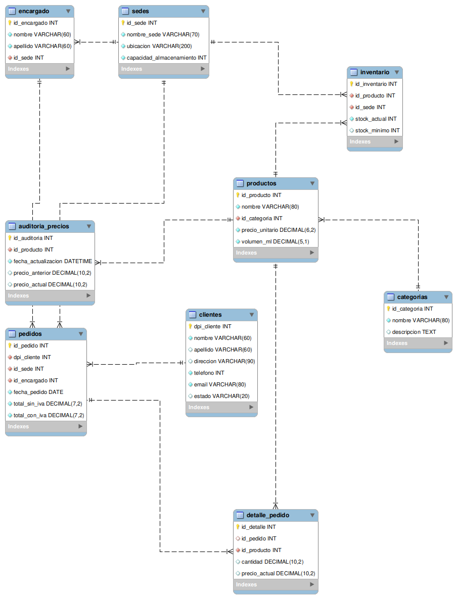

# Diagrama del modelo fisico de la base de datos(UML)

## Descripcion:
**Un diagrama UML es un plano visual que sirve para diseñar, explicar y documentar sistemas de software o procesos de negocio mediante dibujos, líneas y símbolos normalizados**

**UML significa Lenguaje Unificado de Modelado (Unified Modeling Language). Este diagrama ayuda a entender el trabajo en cómo se construirá una aplicación antes de escribir código.**

