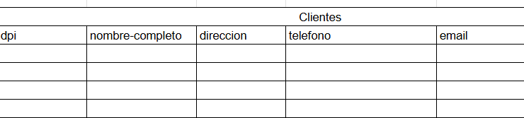
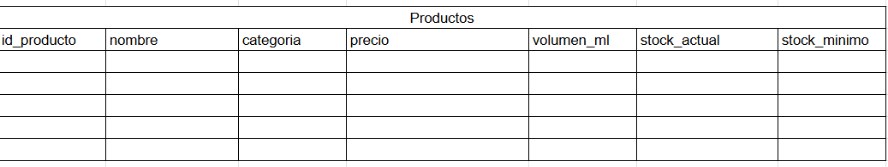
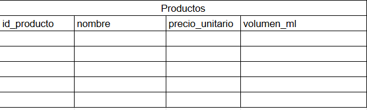
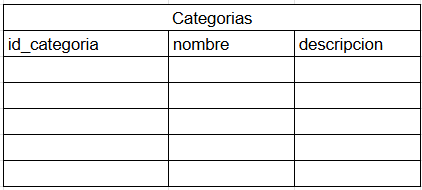
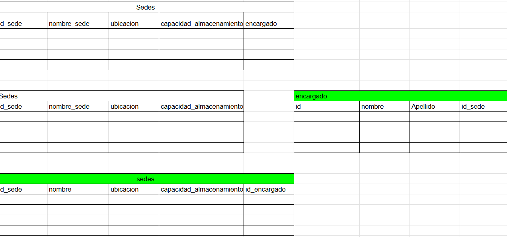
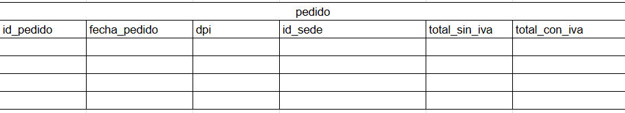
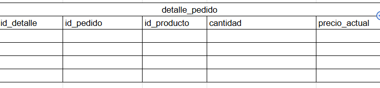

## Normalizacion para las tablas de la base de datos.

## Descripcion.
- Se verificara si cada tabla cumple con las reglas de cada forma normal.

## Preguntas que deben responderse para verificar la normalizacion:
### **1. Primera Forma Normal (1FN): Atomicidad y Clave Primaria**
 **¿Cada celda contiene un único valor atómico?**

Si hay listas, arreglos o valores separados por comas (ej. varios teléfonos en un solo campo), debes separarlos en registros individuales.
¿Existen grupos de columnas repetidas?
Si tienes columnas como Telefono1, Telefono2, Telefono3, debes moverlas a una tabla independiente.
¿Existe una clave primaria definida para identificar de forma única cada fila?
### **2. Segunda Forma Normal (2FN): Dependencia Funcional Completa**
(Aplica únicamente si la clave primaria es compuesta por dos o más columnas).
**¿Cada columna que no forma parte de la clave primaria depende de la TOTALIDAD de la clave primaria?**

Si un atributo depende solo de una parte de la clave compuesta (dependencia parcial), debes extraer esa relación a otra tabla.
### **3. Tercera Forma Normal (3FN): Sin Dependencias Transitivas**
 **¿Existen columnas no clave que dependan de OTRAS columnas no clave?**

Si el campo B depende del campo A, y A no es clave primaria, existe una dependencia transitiva.

## Tablas

1. clientes:

### **1. Primera Forma Normal (1FN): Atomicidad y Clave Primaria**
**¿Cada celda contiene un único valor atómico?**
- Si, por lo tanto ya esta en la primera forma normal.Aunque no tenga datos aun esta regla se cumplira al insertar los datos.

### **2. Segunda Forma Normal (2FN): Dependencia Funcional Completa**
**¿Cada columna que no forma parte de la clave primaria depende de la TOTALIDAD de la clave primaria?**

- Si, cada columna tiene su dependencia de la llave primaria.Por lo tanto cumple con la segunda forma normal.

### **3. Tercera Forma Normal (3FN): Sin Dependencias Transitivas**

**¿Existen columnas no clave que dependan de OTRAS columnas no clave?**

- Todos los campos dependen de la llave primaria unica y no hay dependencia transitiva, por lo que se cumple la tercera forma normal.

### **4. Cuarta Forma Normal (4FN), el requisito previo es cumplir con la forma normal de Boyce-Codd (FNBC) o 3FN estricta.**

**¿Existen en la misma tabla dos o más atributos multivaluados que sean completamente independientes entre sí?**

- No, cada campo depende si o si de la llave primaria unica.

2.productos

### **1. Primera Forma Normal (1FN): Atomicidad y Clave Primaria**
**¿Cada celda contiene un único valor atómico?**
- Si, por lo tanto ya esta en la primera forma normal.Aunque no tenga datos aun esta regla se cumplira al insertar los datos.

### **2. Segunda Forma Normal (2FN): Dependencia Funcional Completa**
**¿Cada columna que no forma parte de la clave primaria depende de la TOTALIDAD de la clave primaria?**

- NO, por lo que se decidio dividir la tabla y extraer el campo categoria para hacer una tabla independiente.Una vez hecho esto, el stock actual y minimo formaran lo que es una tabla inventario.Esto con el fin de que la se cumpla la segunda forma normal.

### **3. Tercera Forma Normal (3FN): Sin Dependencias Transitivas**

**¿Existen columnas no clave que dependan de OTRAS columnas no clave?**

- Todos los campos dependen de la llave primaria unica y no hay dependencia transitiva, por lo que se cumple la tercera forma normal.

### **4. Cuarta Forma Normal (4FN), el requisito previo es cumplir con la forma normal de Boyce-Codd (FNBC) o 3FN estricta.**

**¿Existen en la misma tabla dos o más atributos multivaluados que sean completamente independientes entre sí?**

- No, cada campo depende si o si de la llave primaria unica.

3.sedes

### **1. Primera Forma Normal (1FN): Atomicidad y Clave Primaria**
**¿Cada celda contiene un único valor atómico?**
- Si, por lo tanto ya esta en la primera forma normal.Aunque no tenga datos aun esta regla se cumplira al insertar los datos.

### **2. Segunda Forma Normal (2FN): Dependencia Funcional Completa**
**¿Cada columna que no forma parte de la clave primaria depende de la TOTALIDAD de la clave primaria?**

- No, por esa razon se creo una tabla por aparte la cual es **encargado** ya que no depende por completo de la llave primaria principal.

### **3. Tercera Forma Normal (3FN): Sin Dependencias Transitivas**

**¿Existen columnas no clave que dependan de OTRAS columnas no clave?**

- Todos los campos dependen de la llave primaria unica y no hay dependencia transitiva, por lo que se cumple la tercera forma normal.

### **4. Cuarta Forma Normal (4FN), el requisito previo es cumplir con la forma normal de Boyce-Codd (FNBC) o 3FN estricta.**

**¿Existen en la misma tabla dos o más atributos multivaluados que sean completamente independientes entre sí?**

- No, cada campo depende si o si de la llave primaria unica.

Todas las formas se cumplen despues de haber dividido la tabla y hacer la creacion por aparte la tabla de **encargado**

4.pedido

### **1. Primera Forma Normal (1FN): Atomicidad y Clave Primaria**
**¿Cada celda contiene un único valor atómico?**
- Si, por lo tanto ya esta en la primera forma normal.Aunque no tenga datos aun esta regla se cumplira al insertar los datos.

### **2. Segunda Forma Normal (2FN): Dependencia Funcional Completa**
**¿Cada columna que no forma parte de la clave primaria depende de la TOTALIDAD de la clave primaria?**

- Si, cada columna tiene su dependencia de la llave primaria.Por lo tanto cumple con la segunda forma normal.

### **3. Tercera Forma Normal (3FN): Sin Dependencias Transitivas**

**¿Existen columnas no clave que dependan de OTRAS columnas no clave?**

- Todos los campos dependen de la llave primaria unica y no hay dependencia transitiva, por lo que se cumple la tercera forma normal.

### **4. Cuarta Forma Normal (4FN), el requisito previo es cumplir con la forma normal de Boyce-Codd (FNBC) o 3FN estricta.**

**¿Existen en la misma tabla dos o más atributos multivaluados que sean completamente independientes entre sí?**

- No, cada campo depende si o si de la llave primaria unica.
Cada llave foranea depende ahora de la llave primaria de la tabla pedido, por lo que no hay atributos multivluados.

5. detalle-pedido

### **1. Primera Forma Normal (1FN): Atomicidad y Clave Primaria**
**¿Cada celda contiene un único valor atómico?**
- Si, por lo tanto ya esta en la primera forma normal.Aunque no tenga datos aun esta regla se cumplira al insertar los datos.

### **2. Segunda Forma Normal (2FN): Dependencia Funcional Completa**
**¿Cada columna que no forma parte de la clave primaria depende de la TOTALIDAD de la clave primaria?**

- Si, cada columna tiene su dependencia de la llave primaria.Por lo tanto cumple con la segunda forma normal.

### **3. Tercera Forma Normal (3FN): Sin Dependencias Transitivas**

**¿Existen columnas no clave que dependan de OTRAS columnas no clave?**

- Todos los campos dependen de la llave primaria unica y no hay dependencia transitiva, por lo que se cumple la tercera forma normal.

### **4. Cuarta Forma Normal (4FN), el requisito previo es cumplir con la forma normal de Boyce-Codd (FNBC) o 3FN estricta.**

**¿Existen en la misma tabla dos o más atributos multivaluados que sean completamente independientes entre sí?**

- No, cada campo depende si o si de la llave primaria unica.

Cada llave foranea depende ahora de la llave primaria de la tabla pedido, por lo que no hay atributos multivluados.

## CONCLUSION:

Normalizar antes de crear la base de datos es fundamental porque define el diseño estructural del sistema antes de escribir la primera línea de código o insertar datos.

Sus beneficios principales son:

- Elimina la redundancia: Informacion repetida.

- Garantiza la integridad de los datos: Evita problemas con datos duplicados.

- Previene anomalías de mantenimiento.

- Ahorra tiempo y costos
